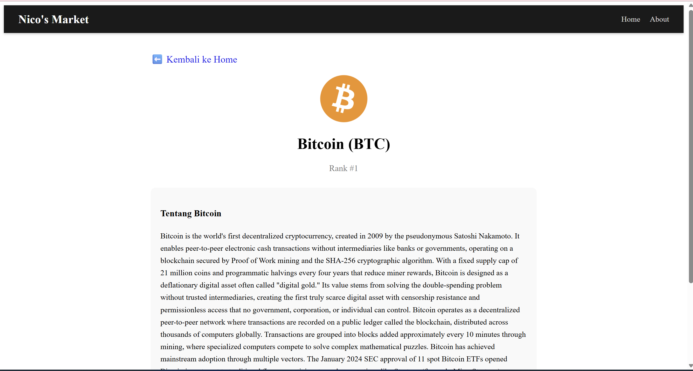
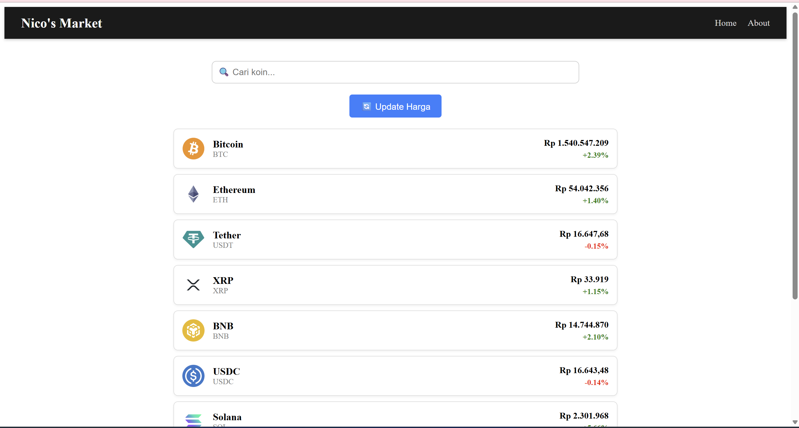

# 🦁 Crypto Market Watch (IDR)


Aplikasi pemantau harga Cryptocurrency real-time berbasis Rupiah (IDR). Project ini dibangun untuk mempermudah pengguna memantau pasar kripto, melakukan pencarian aset, dan melihat detail fundamental koin secara instan.

🔗 **Live Demo:** [Klik Disini untuk Melihat Website](https://LINK_VERCEL_KAMU_DISINI.vercel.app)

---

## 📸 Tampilan Aplikasi

Berikut adalah tampilan antarmuka aplikasi yang telah dibangun:

| Halaman Utama (Search & List) | Halaman Detail Koin |
| :---: | :---: |
|  |  |
*(Fitur Search Bar aktif memfilter koin secara real-time)* | *(Menampilkan Deskripsi, Rank, dan Logo)* |

---

## ✨ Fitur Unggulan

* **🔍 Smart Search System:** Fitur pencarian real-time yang memfilter daftar koin berdasarkan Nama atau Simbol tanpa perlu reload halaman.
* **📡 Real-time Data Fetching:** Terintegrasi langsung dengan **CoinGecko API** untuk data pasar yang akurat.
* **🔄 Dynamic Routing:** Navigasi mulus antar halaman (Home, Detail, About) menggunakan `react-router-dom` (Single Page Application).
* **🎨 Responsive UI:** Desain yang menyesuaikan tampilan desktop dan mobile, dilengkapi dengan *Loading Spinner* interaktif.
* **Navigation Bar:** Global navigation yang konsisten di seluruh halaman.

---

## 🛠️ Tech Stack

* **Frontend Library:** [React.js](https://reactjs.org/) (Vite)
* **Routing:** React Router DOM v6
* **Styling:** CSS Modules & Tailwind CSS
* **API:** CoinGecko Public API
* **Version Control:** Git & GitHub
* **Deployment:** Vercel

---

## 💻 Cara Menjalankan Project (Localhost)

Karena project ini berada di dalam sub-folder, ikuti langkah berikut dengan teliti:

1.  **Clone Repository**
    ```bash
    git clone [https://github.com/NzxCode/Website-From-React.git](https://github.com/NzxCode/Website-From-React.git)
    ```

2.  **Masuk ke Folder Project**
    ```bash
    cd Website-From-React
    ```

3.  **Masuk ke Sub-Folder Aplikasi** (PENTING!)
    ```bash
    cd React-Day-1
    ```

4.  **Install Dependencies**
    ```bash
    npm install
    ```

5.  **Jalankan Server**
    ```bash
    npm run dev
    ```

---

## 👨‍💻 Developer Profile

Project ini dikembangkan oleh:

* **Nama:** Nicolas Gabriel Kurnadi
* **Institusi:** Universitas Tarumanagara (Fakultas Teknologi Informasi)
* **Role:** Frontend Developer Student
* **GitHub:** [@NzxCode](https://github.com/NzxCode)

---
*Dibuat dengan ❤️ menggunakan React.js*
